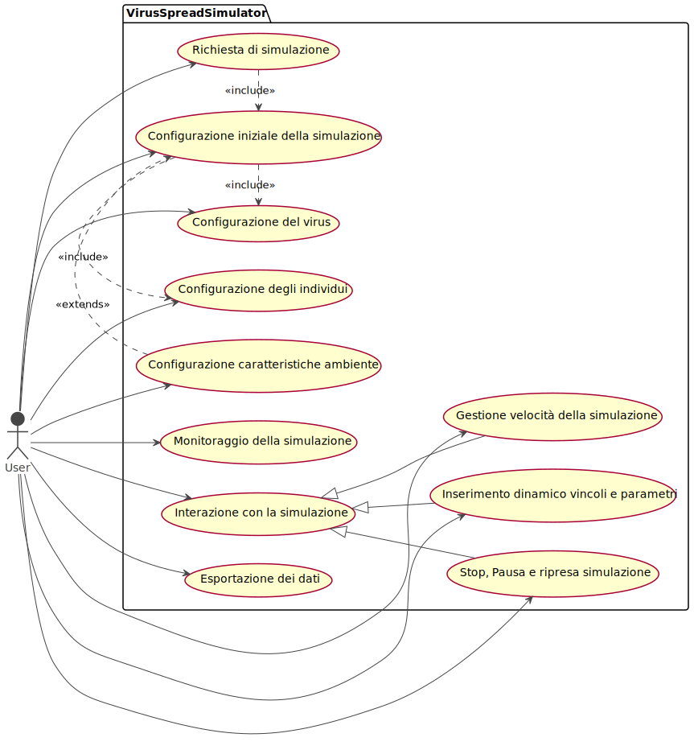
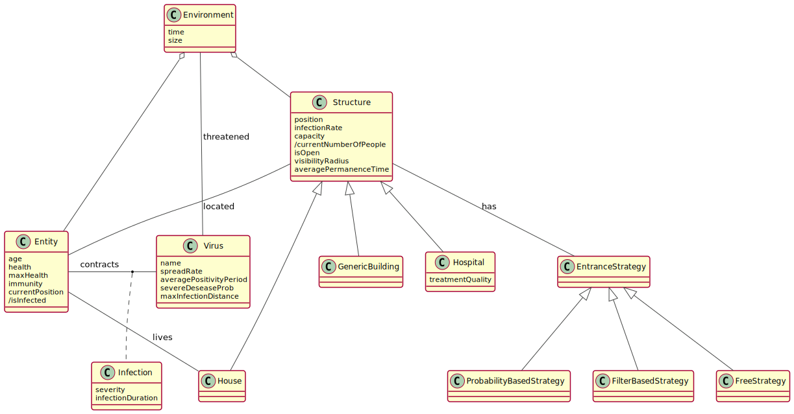

 

# Requisiti

## Business

1. Requisiti di Business
   + 1.1.  Simulazione della diffusione di un virus all’interno di una popolazione di individui che interagisce in un ambiente limitato
     + 1.1.1. generazione di diversi scenari configurabili attraverso mappe personalizzate
       + 1.1.1.2. presenza di diverse tipologie di strutture con caratteristiche personalizzabili legate al virus
     + 1.1.2. definizione di una configurazione statica che riguarda diversi aspetti della simulazione, dell’ambiente e degli individui.
     + 1.1.3. interazione con la simulazione per la modifica e l’aggiunta di ulteriori parametri o vincoli.
     + 1.1.4. presenza di un tempo virtuale e di un ciclo giorno/notte.
     + 1.1.5. Visualizzazione, monitoraggio ed esportazione di informazioni e statistiche riguardanti l’andamento della simulazione
   
   

## Utente

Per essere il più vicini possibile ad una situazione agile reale, Andrea Acampora riveste il ruolo di committente all’interno di questo progetto. Il diagolo, portato avanti tra il Product Owner e il Committente può essere riassunto nelle seguenti intervista: 

> "Faccio parte del comitato tecnico scientifico. Alla luce della recente pandemia ho la necessità di un software, preferibilmente leggero e multipiattaforma, che sia in grado di simulare la diffusione di un virus all'interno della popolazione. 
> Dalle nostre recenti analisi e dalle statistiche fornite dal ministero si evince una difficoltà nel prevedere i livelli di contagio in situazioni che prevedono l'interazione tra individui in spazi aperti e/o all'interno di strutture. A fronte di ciò si richiede la possibilità di configurare la simulazione in termini di caratteristiche degli individui, delle strutture e del virus. Nello specifico deve essere possibile descrivere la popolazione in termini di età e cardinalità. Le strutture, le quali avranno pericolosità di contagio personalizzata, possono essere collocate arbitrariamente all'interno dell'ambiente. Il virus deve essere configurato considerando il tasso di diffusione, periodo medio di positività e la probabiltà di sviluppare una forma grave della malattia. 
> Collaborando con vari team di ricerca internazionali, è necessario che la configurazione sia il più possibile agile ed esprimibile in un linguaggio english-like utilizzando la terminologia propria del settore. 
> La simulazione deve rispecchiare nel modo più fedele possibile l'avanzare della giornata nel mondo reale in cui la maggior parte degli individui interagisce all'aperto e all'interno delle strutture prevalentemente durante il giorno con un afflusso verso le proprie abitazioni durante le ore notturne. Gli individui potranno quindi contrarre il virus muovendosi all'interno dell'ambiente e interagendo con le strutture in loro prossimità considerando strategie di ingresso personalizzate per ciascuna di esse. 
> Si richiede la possiblità di introdurre una particolare tipologia di struttura, l'ospedale, necessario per la cura degli individui, simulando in questo modo la pressione del virus sul reparto sanitario. 
> Al fine di anticipare e simulare le decisioni prese nella gestione della pandemia è richiesta la possibliltà di interagire dinamicamente con la simulazione inserendo vincoli e parametri dinamici quali obbligo di indossare la mascherina, chiusura di strutture e introduzione di una campagna vaccinale. 
> Vi è inoltre la necessità di monitorare costantemente l'andamento della simulazione rispetto all'evoluzione del contagio e lo spostamento degli individui mediante interfaccia grafica. Essa deve comprendere anche grafici con le principali statistiche. Quindi è sicuramente utile la possibilità di mettere in pausa e stoppare preventivamente la simulazione ed impostarne la velocità. 
> Potendo eseguire simulazioni con parametri differenti, si rende necessario un meccanismo di esportazione dei dati a fini comparativi e di archiviazione. In particolare, i dati rilevanti sono il tasso di letalità del virus, il numero di individui morti, malati e curati, il numero totale di malati gravi e il periodo medio di ospedalizzazione."

Al fine di schematizzare esplicitando maggiormente i requisiti utente è stato prodotto il seguente diagramma dei casi d'uso utile anche per le fasi successive. 

Alla luce di un approfondimento dell'intervista con il committente si evincono i seguenti requisiti:  

2. Requisiti utente
   + 2.1. Configurazione delle caratteristiche iniziali della simulazione
     + 2.1.1. Durata della simulazione in termini di giorni
     + 2.1.2. Cardinalità della popolazione di individui
     + 2.1.3. Numero di abitanti per casa
     + 2.1.4. Media e deviazione standard dell’età della popolazione
     + 2.1.5. Caratteristiche virus
       + 2.1.5.1. Tasso di diffusione del virus
       + 2.1.5.2. Probabilità di sviluppo di una forma grave della malattia associata al virus
       + 2.1.5.3. Periodo medio di positività al virus
   + 2.2. Configurazione delle caratteristiche dell’ambiente
     + 2.2.1. Dimensione della griglia che rappresenta logicamente l’ambiente
     + 2.2.2. Descrizione delle strutture presenti nell’ambiente
       + 2.2.2.1. Parametri della struttura
         + 2.2.2.1.1. Tipologia
           + 2.2.2.1.1.1. Edificio Generico: tipologia di struttura configurabile dall’utente con cui gli individui possono interagire
           + 2.2.2.1.1.2. Ospedale: tipologia di struttura dedicata alla cura degli individui
         + 2.2.2.1.2. Disposizione in termini di coordinate
         + 2.2.2.1.3. Numero massimo di persone
         + 2.2.2.1.4. Raggio di visibilità della struttura espresso in numero di celle
         + 2.2.2.1.5. Media e deviazione standard del tempo di permanenza di un individuo nella struttura
         + 2.2.2.1.6. Pericolosità di contagio all’interno della struttura
         + 2.2.2.1.7. Strategia per discriminare l’accesso alla struttura
           + 2.2.2.1.7.1. Filtro su media e deviazione standard dell’età degli individui
           + 2.2.2.1.7.2. Entrata libera (default)
           + 2.2.2.1.7.3. Entrata basata su probabilità di ingresso generica alla struttura
   + 2.3. Interazione con la simulazione tramite GUI
     + 2.3.1. Comandi stop, pausa, riprendi
     + 2.3.2. Gestione della velocità di simulazione
     + 2.3.3. Modifica e inserimento dinamico di vincoli e/o parametri
       + 2.3.3.1. Obbligo mascherina
       + 2.3.3.2. Chiusura di una tipologia di struttura
       + 2.3.3.3. Vaccinazione esprimendo la percentuale di persone sottoposte
   + 2.4. Visualizzazione dell’andamento della simulazione tramite GUI
     + 2.4.1. Evoluzione ambiente e spostamento individui
     + 2.4.2. Grafici sui dati principali della simulazione
   + 2.5. Esportazione dati
     + 2.5.1. Tasso letalità
     + 2.5.2. Individui morti, malati, curati
     + 2.5.3. Malati gravi
     + 2.5.4. Periodo medio di ospedalizzazione

Infine, in seguito ai requisiti utente elencati, è emerso il seguente dominio modellato attraverso il diagramma delle classi di analisi qui riportato.

## Funzionali

3. Requisiti funzionali
   + 3.1. La simulazione è basata su un modello ad eventi discreti in cui è presente un tempo virtuale che scandisce le iterazioni.
     + 3.1.1. l’avanzare del tempo virtuale e quindi delle iterazioni sancisce l’alternanza del ciclio giorno/notte simulando l’avanzamento delle giornate.
     + 3.1.2. Nel corso del giorno gli individui si muoveranno liberamente all’interno della mappa.
     + 3.1.3. Nel corso della notte in modo randomico alcuni individui saranno costretti a tornare nella propria casa.
   + 3.2. L’ambiente della simulazione è rappresentato logicamente in due dimensioni attraverso una griglia che consente la disposizione delle strutture e lo spostamento degli individui tramite coordinate.
     + 3.2.1. All’inizio della simulazione vengono generate un numero ottimale di case e disposte in zone esterne alla griglia.
     + 3.2.2. Ogni individuo verrà associato ad una casa da cui inizierà la giornata.
   + 3.3. Ciascuna struttura occupa una cella della griglia ed ha un raggio di visibilità espresso in celle.
     + 3.3.1. Le strutture sono definite dalle caratteristiche espresse dall’utente (2.2.2) e dal numero attuale di persone presenti al suo interno.
     + 3.3.2. Una volta nel raggio, ogni individuo sceglie di entrare con una probabilità che dipende dalle caratteristiche della struttura stessa.
       + 3.3.2.1. Il numero corrente di persone nella struttura deve essere inferiore al numero massimo.
       + 3.3.2.2. Assenza di un intervento dell’utente sulla chiusura della struttura (2.3.3.2).
       + 3.3.2.3. Strategia di accesso alla struttura (2.2.2.1.7).
     + 3.3.3. L’individuo rimarrà all’interno della struttura per un periodo di tempo che dipende anch’esso dalle caratteristiche della struttura (2.2.2.1.5).
     + 3.3.4. Terminato il periodo di permanenza nella struttura, l’individuo sarà posto in una delle celle esterne ed adiacenti al raggio della struttura stessa.   
   + 3.4. Un individuo è un’entità che occupa una posizione all’interno della griglia
     + 3.4.1. Ad ogni iterazione si muove in modo casuale in una qualsiasi cella adiacente a quella corrente.
       + 3.4.1.1. Due individui possono trovarsi nella stessa posizione
     + 3.4.2. La simulazione genera un insieme (2.1.2) di individui con diverse caratterstiche
       + 3.4.2.1. Età, generata casualmente seguendo una distribuzione Gaussiana con parametri specificati eventualmente dall’utente (2.1.4).
       + 3.4.2.2. Stato di salute, rappresentato mediante un valore da 0 a 100.
         + 3.4.2.2.1. Il valore di partenza è influenzato dall’età dell’individuo
         + 3.4.2.2.2. Nel momento in cui il valore raggiunge lo 0 l’individuo è considerato deceduto.
         + 3.4.2.2.3. Un individuo non contagiato tende a riacquisire la propria salute.
       + 3.4.2.3. Ogni individuo ha un valore che rappresenta la sua immunità al virus.
         + 3.4.2.3.1. Si incrementa in seguito di una guarigione dal virus o ad una somministrazione di un vaccino.
         + 3.4.2.3.2. Il valore viene decrementato con l’avanzare della simulazione.
   + 3.5. Il contagio tra diversi individui avviene dentro e fuori dalle strutture.
     + 3.5.1. Fuori dalle strutture, il contagio si verifica per prossimità di un individuo infetto ad uno sano, con una probabilità che varia in base alla distanza tra essi.
     + 3.5.2. All’interno delle strutture, il contagio avviene con una probabilità che dipende dalla pericolosità di contagio all’interno della struttura (2.2.2.1.6) e dal numero di infetti presenti nella struttura.
     + 3.5.3. Indipendentemente dal luogo, il contagio è influenzato dal tasso di diffusione del virus (2.1.5.1), dall’immunità dell’individuo (3.4.2.3) e dalla presenza di alcuni vincoli o parametri dinamici settabili durante la simulazione.(2.3.3).
     + 3.5.4. L’ individuo contrae il virus per un determinato periodo.
       + 3.5.4.1. Il periodo viene calcolato seguendo una distribuzione Gaussiana a seconda del parametro di durata media (2.1.5.3).
       + 3.5.4.2. Durante il periodo di positività al virus, lo stato di salute diminuisce in modo costante a seconda della gravità della malattia associata al virus che dipende dallo stato di salute nel momento del contagio e dal parametro probabilità di sviluppare una forma grave della malattia (2.1.5.2).
   + 3.6. L’unico modo per curare un individuo dalla malattia provocata dal virus è l’ospedale.
     + 3.6.1. Nel momento in cui la vita di un individuo scende sotto a una soglia critica esso può entrare in un ospedale al fine di ristabilire la propria salute.
     + 3.6.2. Nel caso in cui nell’ambiente non siano presenti ospedali oppure abbiano raggiunto la capienza massima, l’individuo continua a spostarsi all’interno dell’ambiente.
     + 3.6.3. Nel caso in cui sia disponibile un ospedale, l’individuo viene spostato al suo interno e, per il periodo di permanenza, la cura aumenta il suo stato di salute.
   + 3.7. La configurazione fornita dall’utente viene espressa mediante l’utilizzo di un DSL english-like.
   + 3.8. Durante la simulazione vengono visualizzati i dati principali eventualmente tramite l’ausilio di grafici.
   + 3.9. Esportazione dei dati della simulazione mediante formati standard come da requisito 2.5

## Non funzionali

4. Requisiti Non Funzionali
   + 4.1. Mantenimento della fluidità del sistema e dell’interattività anche su dispositivi con risorse limitate.
     + 4.1.1. Requisito minimo: 4 GB di RAM, CPU Dual Core
   + 4.2. L’applicazione deve essere cross-platform ossia funzionare correttamente su diversi sistemi operativi: Linux, Windows, Mac OS.
   + 4.3. Estendibilità del sistema, in particolare delle tipologie di strutture e delle strategie di accesso ad esse.

## Implementazione

5. Implementazione
   + 5.1. Il framework sarà implementato utilizzando come linguaggio principale Scala e testato mediante Scalatest.

