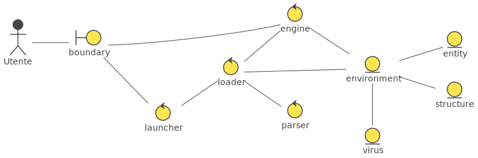
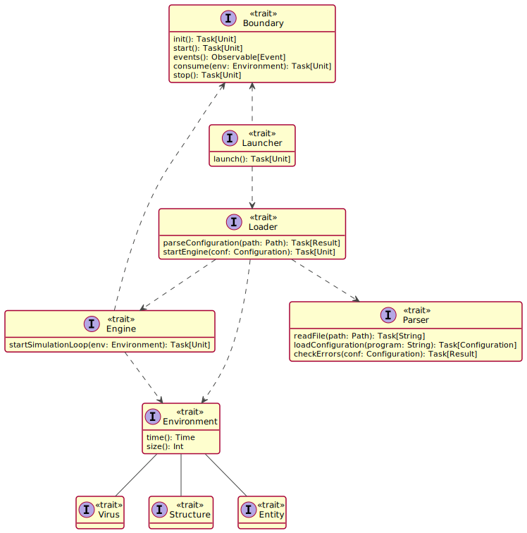

## Design Architetturale

### Architettura complessiva

Per garantire una corretta separazione delle responsabilità e per fornire flessibilità ed estendibilità alle componenti del software, il progetto adotta il pattern architetturale **ECB** (**Entity-Control-Boundary**).
Di seguito è fornito il diagramma che riprende gli elementi core dell'architettura proposta.

### Descrizione del pattern architetturale utilizzato

L'architettura è stata progettata partendo direttamente dal diagramma dei casi d’uso fornito nel capitolo dei requisiti, come tipico delle architetture basate su ECB, dove sono presenti gli attori del sistema e i rispettivi casi d'uso. 
La distinzione di tre diverse tipologie di oggetti all’interno del sistema, *entity*, *control* e *boundaries*, porta a dei modelli che sono più resilienti a cambi futuri:

- *Boundary*: ciascun *boundary* incapsula l'interazione con gli attori del sistema, come ad esempio utenti o servizi esterni. Tipicamente essi vengono cambiati con una frequenza maggiore rispetto ai *control*.
- *Control*: ciascun *control* implementa la business-logic richiesta per gestire l'esecuzione di un caso d'uso coordinando le *entità* coinvolte ed eventualmente interagendo con uno o più *boundary*. Tipicamente essi vengono cambiati con una frequenza maggiore rispetto alle *entity*.
- *Entity*: rappresentano il modello del dominio del sistema.

Ciascun *Boundary* rappresenta quindi una diversa interazione tra un attore ed il sistema. Il *Control* invece rappresenta la realizzazione di un determinato caso d’uso da parte di un attore tramite uno specifico *Boundary* mentre le *Entities* rappresentano i dati persistenti del dominio.
Si applicano sulle componenti i seguenti vincoli di interazione: 

1. Gli attori possono interagire solo con *boundary*.
2. I *boundary* possono interagire solo con *control* e *attori*.
3. *Entity* possono essere a conoscenza di altre *entity* ed interagire solo con i *control*.
4.  I *control* possono interagire con i *boundary*, le *entity* e con altri *control*, ma non con gli attori. 

La scelta è ricaduta sul pattern ECB per la sua compatibilità con la *Clean Architecture*, che ci ha permesso di ottenere i seguenti vantaggi: 

+ Separazione delle responsabilità, suddividendo il software in layers che possono essere aggiornati e mantenuti in modo indipendente. 
+ Indipendenza dai framework.
+ Orientandosi ad una progettazione a componenti è possibile applicare il testing in maniera agile sostituendo alcuni di essi, ad esempio un *control*(che implementa un particolare caso d'uso) o un *boundary*, con test double.
+ I vincoli di interazione di ECB rispettano la *dependency rule* descritta dalla Clean Architecture, applicando inoltre nel caso dell'interazione tra boundary e controller la *dependency inversion*. 

Inoltre ECB ha facilitato il soddisfacimento dei seguenti requisiti, la cui realizzazione altrimenti sarebbe stata più complessa: 

+ I requisiti utente 2.4, 2.5 e 2.6 prevedono tre modalità di interazione tra l'utente e il sistema: visualizzazione dell'andamento della simulazione tramite GUI JVM-based, GUI JS-based ed esportazione dei dati. In questo caso il concetto di boundary presente in ECB ha semplificato la progettazione ed ha evitato ripetizioni di codice in quanto entramble le GUI e l'esportatore non sono altro che tre boundary distinti che rispettano la stessa API nei confronti del control.
+ Essendo l'engine elemento centrale dei software di simulazione, è necessario isolarlo adeguatamente al giusto livello di astrazione al fine di essere manutenibile. Grazie alla caratteristiche e ai vantaggi di ECB sopracitati, quali separazione delle responsabilità, indipendenza dai framework e testabilità, oltre alla dependency rule, è stato possibile progettarlo in maniera più agile. 
+ Il requisito non funzionale 4.3 che prevede una generale estendibilità del sistema.  

### Descrizione dei componenti dell'architettura

Lo schema architetturale fornito precedentemente evidenzia i seguenti componenti:

+ **Boundary**: rappresenta il concetto generico di *boundary* descritto in ECB, è stato scelto di non esplicitare gli specifici *boundary* presenti nel sistema in quanto espongono tutti la stessa api per l'interazione con il *control*. Inoltre, come descritto precedentemente, è necessario rappresentare il sistema mantenendo una sufficiente flessibilità che permetta l'aggiunta di diverse modalità di interazione con gli attori del sistema. 
+ **Launcher**: è un componente appartenente al control e il punto di ingresso dell'applicazione. A seguito della segnalazione del boundary dell'intenzione dell'attore di avviare la simulazione si occupa di coordinare l'avviamento della simulazione comunicando con il loader ed eventualmente con i boundary in caso di errori nella configurazione fornita.
+ **Loader**: è un componente appartenente al control. Coordina il caricamento ed il controllo di validità del file di configurazione fornito dall'attore sfruttando il componente Parser e si occupa della creazione e del caricamento dell'ambiente, poi restituito all'engine della simulazione. 
+ **Parser**: è un componente appartente al control. Effettua controlli rispetto alla completezza ed alla validità delle specifiche incluse nella configurazione fornita dall'attore. Questa modellazione rende più flessibile l'aggiunta di diverse tipologie di parser ciascuna dedicata ad uno specifico formato di file.
+ **Engine**: è un componente appartenente al control. Esso si occupa di gestire il simulation loop aggiornando la simulazione e interagendo con i boundary.
+ **Environment** : si tratta dell'*entity* principale che rappresenta l'ambiente simulato con tutte le caratteristiche. Nello schema architteturale sono riportate le principali *entity* che compongono l'environment: 
  + **Virus** : *entity* che contiene le principali informazioni del virus. 
  + **Entity** : *entity* che contiene le principali informazioni di ogni individuo all'interno della simulazione.  
  + **Structure** : *entity* che contiene le principali informazioni di ogni struttura all'interno della simulazione. 

Di seguito un diagramma UML che mette in evidenza i *trait* principali dell'architettura descritta in questo capitolo. Il diagramma astrae dall'effettiva implementazione di alcuni tipi di dati citati esplicitando esclusivamente l'utilizzo della libreria **Monix**, la quale ha influenzato il suddetto design.

Inoltre, al fine di rappresentare il flow derivato dall'architettura mostrata, viene fornito il seguente diagramma di sequenza.

