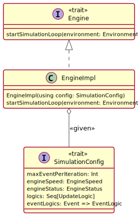

## Design di dettaglio

Dopo aver descritto l'architettura del sistema, si procede con il design di dettaglio, in cui si evidenziano le scelte di progettazione dei componenti principali. In questo capitolo verranno esposti, oltre alle scelte di design, i design pattern utilizzati ed una breve descrizione di come il codice è stato organizzato.

### Obiettivi

Il design del sistema segue un approccio che cerca di combinare i vantaggi del mondo funzionale e del mondo ad oggetti. In generale, la linea che abbiamo seguito è quella di preferire l'approccio funzionale favorendo la dichiaratività, l'immutabilità e la descrizione lazy della computazione ed evitando o eventualmente incapsulando i side-effects e le eccezioni.
In particolare, si è scelto di perseguire l'immutabilità evitando o incapsulando side-effects ed eccezioni in quanto nella maggior parte dei casi ciò permette di semplificare la logica del programma e soprattutto l'analisi e la comprensione del codice. Infatti, quando un elemento è mutabile, occorre ricostruire il suo stato rispetto a tutto il flow in cui esso viene utilizzato. Quindi, in questo design si è scelto di stressare l'immutabilità, anche per cercare di ottenere, ove possibile, il concetto di funzione pura, la quale a parità di input restituisce sempre lo stesso output. 

Inoltre, si è deciso di adottare, ovunque possibile, un approccio monadico. Infatti questo approccio permette di rappresentare sequenze, anche complicate, di funzioni attraverso pipeline succinte che astraggono dal control flow e soprattutto dai side-effects. Infatti, l'approccio monadico consente  di rappresentare i side-effects come effects sul quale si ha maggiore controllo ed inoltre, utilizzando la libreria Monix, è stato possibile ottenere facilmente anche il vantaggio di poter descrivere la computazione in modo lazy, limitando i side-effects nell'*end-of-the-world*.
La scelta della libreria Monix per il nostro approccio monadico è derivata dal fatto che Monix possiede la monade *Task*, la quale consente di rappresentare la specifica di una computazione lazy o asincrona che, una volta eseguita, produrrà un risultato, assieme a tutti i possibile side-effect. *Task*s infatti non è *eager*, ed è *referential transparent* nel suo utilizzo safe. Questo permette di dividere l'esecuzione dalla descrizione della computazione, favorendo la dichiaratività.

### Design a componente dell'architettura

Il pattern architetturale *ECB* descritto nel capitolo precedente si presta facilmente alla *component-programming* in cui sostanzialmente ogni elemento appartenente all'entity, al boundary o al control lo si vede come un componente che ha dipendenze da altri (come ad esempio l'engine che necessita dei boundary per poter comunicare loro il nuovo stato). 
Per questo motivo, si è scelto di progettare l'architettura a livello di design di dettaglio scegliendo il **Cake Pattern** grazie al quale è stato possibile rappresentare ogni elemento dell'architettura come un componente con una ben definita interfaccia offerta agli altri componenti, e delle ben definite dipendenze dagli altri componenti. L'applicazione risultate quindi viene costruita instanziando ogni componente e collegandoli in modo da soddisfare le varie dipendenze.

Grazie a questo pattern è stato possibile rappresentare esplicitamente le dipendenze tra i vari elementi architetturali permettendo di fare dependency injection agilmente. 

La combinazione ECB + Cake Pattern ha semplificato notevolmente il raggiungemento del requisito 2.6 il quale comporta la realizzazione di un applicazione cross-platform (JVM e JS). Infatti, ha permesso di limitare al minimo la ripetizione di codice, condividendo tra le diverse piattaforme tutto il design dei componenti di core, limitando le modifiche principali ai boundaries e agli elementi nativi di ogni piattaforma.

Il design di ogni componente è il medesimo:

Come si vede dal diagramma, gli elementi presenti in ciascun componente sono:

- un trait che definisce l'interfaccia, cioè il contratto, del componente; qui chiamato per comodità **ComponentInterface**
- un trait che si occupa di fornire l'instanza del componente; qui chiamato per comodità **Provider**
- un trait, qui chiamato per comodità **Component**, che utilizza le dipendenze richieste dal componente (**Requirements**) e contiene l'implementazione del componente stesso, qui chiamata per comodità **ComponentImpl**.
- un trait che espone tutti i concetti del componente necessari per poter essere utilizzato assieme agli altri, qui chiamato per comodità **Interface**.

Combinando tutto ciò con gli obiettivi del design descritti nella sezione precedente *si può riassumere il design in questo modo*:

- Ogni elemento architetturale è rappresentato come un componente.
- Le entities sono progettate favorendo un approccio funzionale.
- Le computazioni sono rappresentate con un approccio monadico attraverso l'utilizzo della libreria Monix.
- Gli eventi di ogni componente boundary sono rappresentati come stream di eventi attraverso l'uso di *Observable* di Monix.
- I side effects sono limitati all'*end-of-the-world*.

### Boundary

Come anticipato, ciascun *boundary* incapsula l'interazione con gli attori del sistema.
Il pattern ECB pone le sue fondamenta sul fatto che tutti i Boundary siano uguali e passavi, ricevendo le stesse informazioni dai control ed incapsulando le interazioni. Le interazioni degli attori del sistema con i componenti boundary vengono rappresentati nel nostro design come stream di eventi, sfruttando **Observable** di Monix.

Tra i boundary che possono essere iniettati all'interno del simulatore deve essere sempre essere prensente un **ConfigBoundary** dedicato al caricamento della configurazione e alla visualizzazione degli errori in essa. La necessità di un tipo speciale di Boundary è nata dal fatto che nel nostro caso abbiamo due tipologie di eventi:

- *eventi asincroni*: sono quelli che vengono emessi dall'interazione dell'attore con il sistema
- *eventi sincroni*: rappresentano quegli eventi necessari per la configurazione della simulazione, e che quindi devono essere ricevuti in un certo ordine.

Al fine di rispettare la *dependency rule* descritta dalla Clean Architecture e da ECB, si è deciso di modallare un ulteriore trait **ConfigBoundary** che estende il trait **Boundary** con due metodi necessari per ottenere la configurazione e segnalare errori al boundary. In questo modo, il componente Boundary rimane passivo, infatti non eseguirà mai chiamate dirette agli elementi del control rispettando la *dependency rule*.

Perciò, tra i boundary specificati per l'applicazione ve ne sarà solamente uno di tipo ConfigBoundary, il quale gestirà, tra le altre cose, anche la parte di inizializzazione della simulazione con il compito di fornire la configurazione e gestire gli eventuali errori verso l'attore del sistema.

I boundary sviluppati sono i seguenti:

- **GUI-JVM**: si occupa della creazione di un'interfaccia grafica dell'applicazione Desktop jvm-based.
- **Esportatore**: si occupa dell'esportazione in un foglio di calcolo dei dati aggregati e delle statistiche riguardanti la simulazione
- **GUI-JS**: si occupa della creazione dell'interfaccia grafica della WebApp js-based. Come detto precedentemente infatti, l'applicazione sviluppata dovrà essere cross-platform e la specifica di un apposito boundary rientra tra le parti platform-specific.

Considerando la necessità di eseguire il rendering della simulazione, nonostante solitamente i framework per gestire le GUI siano fortemente object-oriented e sfruttino principalmente side-effects si è deciso comunque di descrivere la struttura delle view utilizzando un approccio monadico, isolando tutto ciò che non è funzionale nell'*end-of-the-world*. 
A tal proposito, al fine di isolare l'approccio a side-effects tipico del disegno degli elementi su *"canvas"*, è stata creata la **type-class** **Drawable** la quale rappresenta l'estensione di un tipo generico con le capacità di disegno. Questo è un concetto comune e non platform-specific.

La type class è stata progettata per lavorare con gli extension methods di Scala (non facilmente rappresentabili in UML). 
Grazie a questa type-class la capacità di essere disegnati può essere inserita a piacere su ogni tipo definito anche dopo la sua definizione. Tutto ciò grazie al pattern **type class** che ci permette di definire metodi dotati di **polimorfismo ad-hoc**. 
Essendo un concetto comune a tutti i boundary, Drawable astrae dal tipo di grafica utilizzata e definisce al suo posto un **abstract type** (**Graphic**).
In questo modo i boundary platform-specific potranno specificare il proprio tipo ed eseguire il "pimping" di operazioni basate su di essa.

Inoltre, al fine di rappresentare il concetto di sorgente di eventi a livello di boundary è stato modellato il trait **EventSource**.

Il seguente concetto modella tutto ciò che è in grado di emettere eventi dovuti all'interazione dell'attore: pulsanti, text fields, ecc... In questo modo i suddetti componenti possono essere integrati con maggiore facilità ed elasticità all'interno di un contesto monadico.
**Event** rappresenta gli eventi emessi dai boundary ed è modellato attraverso un *Product Type*. Ogni evento specifica il suo interesse rispetto ad un particolare stato dell'engine, esprimendo il fatto che esso, in un particolare stato dell'applicazione, potrebbe perdere di significatività.

#### JVM

Il boundary che gestisce la gui jvm-based si occupa di visualizzare l'interfaccia grafica del simulatore dell'applicazione Desktop.
L'applicazione è composta da due schermate principali che soddisfano i mockup sviluppati ed approvati dal committente e mostrati nel capitolo dei requisiti. 

Il design di questo boundary è avvenuto considerando l'utilizzo della libreria **Java Swing**. Al fine di poter integrare agilmente il design monadico di tutto il sistema con la gui, si è deciso di adottare un approccio in cui le varie view consistono in descrizioni monadiche lazy della costruzione e del comportamento dei componenti, in modo tale da aderire al paradigma funzionale incapsulando la natura object-oriented e side-effect oriented di **Java Swing**.
Inoltre, considerando che i boundary comunicano con i control emettendo eventi, tutti i componenti di Java Swing necessari all'interazione degli attori sono stati ridefiniti attraverso dei wrapper ad-hoc che consentono di integrarli agilmente in un contesto monadico (**MonadComponents**). In particolare, ogni componente in questione (wrapper di: *JButton*, *JComboBox*, *JTextField*, ...) estende il trait **EventSource** descritto in precedenza.

In questo modo ogni componente, il quale esprime, in Java Swing, ogni comportamento attraverso side-effect, diventa un componente facilmente integrabile in un contesto monadico nel quale il flow è gestito attraverso stream di eventi.

Considerando che *Java Swing* è fortemente object-oriented e con un approccio basato sui side-effects, al fine di gestire il disegno dei concetti di Simulazione è stata utilizzata la type-class *Drawable* descritta precedentemente. Maggiori dettagli verrano forniti nel capitolo *Implementazione*.

#### JS

Il boundary che gestisce la gui js-based si occupa di visualizzare l'interfaccia grafica del simulatore della WebApp.
In questo caso è stata sviluppata un'unica schermata in quanto non erano previste indicazioni dal committente.

Il design di questo boundary è avvenuto considerando l'utilizzo della libreria **Scalajs**. Scalajs, per quanto riguarda l'API fornita, emula fortemente JavaScript rendendo poco agevole il suo utilizzo diretto in un approccio monadico. Perciò, al fine di poter integrare agilmente il design monadico di tutto il sistema con la gui, si è deciso di adottare un approccio in cui le varie view consistono in descrizioni monadiche lazy della costruzione e del comportamento dei componenti similmente a quanto descritto per il *boundary jvm-based*.

Similmente a quanto descritto precedentemente, considerando che i boundary comunicano con i control emettendo eventi, tutti i componenti HTML-based di Scalajs necessari all'interazione degli attori sono stati ridefiniti attraverso dei wrapper ad-hoc che consentono di integrarli agilmente in un contesto monadico (**MonadComponents**). In particolare, ogni componente in questione (wrapper di: *Button*, *Select*, *Input*, ...) estende il trait **EventSource** descritto in precedenza.

Al fine di gestire il disegno dei concetti di Simulazione è stata utilizzata la type-class *Drawable* descritta precedentemente. Maggiori dettagli verrano forniti nel capitolo *Implementazione*.

#### Exporter

L'**Exporter** è un boundary con il compito di esportare alcune statistiche e dati aggregati della simulazione su un file di testo in formato *CSV*. Quest'ultimo viene aggiunto come componente al *launcher* dell'applicazione ed in quanto *boundary* ad ogni step della simulazione riceve *l'environment* aggiornato.

L'esportazione dei dati su file avviene continuamente ad ogni step in modo da poter analizzare, una volta terminata la simulazione, l'andamento dei parametri principali nel corso del tempo.

Al fine di ottenere un design che separi l'estrazione delle statistiche dal concetto di Exporter stesso, l'intero processo di estrazione dei dati viene delegato al trait **DataExtractor**.
Un DataExtractor contiene un nome utile per comprendere la tipologia di statistica che si intende calcolare ed un metodo *generico* per estrarre quest'ultima a partire dall'*environment* della simulazione.

Al fine di elencare e riassumere tutte le tipologie di dati e statistiche che è possibile esportare è stata creata l'enum **StatisticalData**. 
Inoltre, attraverso l'utilizzo del pattern **Adapter** , implementato con **Implicit Conversions**, si è reso possibile evitare di utilizzare ogni singola implementazione del trait DataExtractor mentre è sufficiente creare un elenco di statistiche dell'enum ed il  pattern si occuperà poi di istanziare per ognuna il rispettivo estrattore. 

Infine, l'aggiunta del trait *DataExtractor* si è rilevata utile anche nella creazione dei grafici in quanto anch'essi hanno l'obiettivo di mostrare alcuni dati aggregati durante la simulazione. In questo modo si sono evitate inutili ripetizioni di codice ed è stato relativamente semplice implementare i vari grafici presenti.

Maggiori dettagli sulle effettive implementazioni degli estrattori e sull'esportatore verranno forniti nel capitolo *Implementazione*.

### Launcher

Come anticipato, il Launcher è un componente appartenente al control ed è il punto di ingresso dell'applicazione. Essendo un componente dell'architettura esso è modellato tramite il **Cake pattern** come descritto precedentemente.

Il suo scopo è coordinare l'avviamento della simulazione comunicando con il loader ed eventualmente con i boundary in caso di errori nella configurazione fornita.

Al fine di mantenere l'approccio funzionale, si evitano qualsiasi forma di eccezione incapsulandole nei tipi di dato ritornati. In particolare, è possibile notare **ConfigurationResult**, un Product Type restituito dal metodo *parseConfiguration* del loader, che incapsula gli eventuali errori all'interno della configurazione fornita dall'utente.

### Loader

Il Loader,  componente appartenente al *Control*, si occupa di caricare la configurazione fornita dall'utente, creare l'environment iniziale ed infine lanciare l'engine della simulazione.

#### Parser

#### Reader

### Engine

L'Engine si occupa di gestire il simulation loop aggiornando la simulazione e interagendo con i boundary. Esso è un componente dell'architettura, quindi è modellato tramite il **Cake pattern** come descritto precedentemente.

Nel design dell'engine e quindi nel design del simulation loop è opportuno considerare gli obiettivi di design descritti precedentemente. Infatti, si desidera creare un motore con cui gestire la simulazione che adotti un approccio funzionale e il più possibile dichiarativo. 
Il simulation loop è stato espresso mediante un approccio monadico basato su Monix che ha consentito di specificarlo attraverso una descrizione lazy della la computazione rimanendo altamente dichiarativi.
Infatti, come spiegato successivamente, la gestione degli eventi, delle logiche e degli aggiornamenti in generale è stato espresso mantenendo un elevata dichiaratività, senza preoccuparsi del control-flow e senza gestire in modo imperativo i thread di esecuzione.

Il compito dell'Engine, oltre a raccogliere gli eventi provenienti dai boundary, è eseguire le logiche di aggiornamento della simulazione. Esse devono essere eseguite nell'ordine specificato. Inoltre, come da requisito 2.3.2 è necessario poter impostare la velocità di simulazione oltre che gestire lo stato (2.3.1) e gestire le interazioni dinamiche dell'utente (2.3.3).
Da questo ne deriva la necessità di esprimere una configurazione dell'Engine, la quale sia indipendente dalla particolare instanza di simulazione, e che possa essere impostata a livello di applicazione. A tal fine è stato creato il trait **SimulationConfig** che rappresenta la configurazione da utilizzare nell'Engine. Al fine di iniettare la configurazione nell'engine, esso è stato progettato per utilizzare un **context parameter** di tipo **SimulationConfig** a livello di costruttore.
In questo modo la configurazione viene fornita con un approccio che rivela maggiormente l'intento configurativo.

*SimulationConfig* necessita delle seguenti configurazioni:

- *maxEventPerIteration*: al fine di evitare una possibile starvation dell'engine dovuta all'arrivo continuo di eventi dai boundary, si considerano solamente un certo numero di eventi ad ogni tick dell'engine; questo parametro consente di impostarne il numero.
- *engineSpeed*: rappresenta la velocità di un singolo tick dell'engine.
- *engineStatus*: rappresenta lo stato corrente dell'engine. Gli stati sono *running*, *paused* e *stopped*.
- *logics*: rappresenta la sequenza di logiche da eseguire ad ogni iterazione.
- *eventLogics*: rappresenta la funzione che associa ogni evento proveniente dai boundary alla specifica logica in grado di gestirlo.

In questa sezione si astrae da come viene effettuato l'aggiornamento di tali configurazioni (come quella della velocità e dello stato).
Come si vede, grazie alla configurazione, l'engine ha a disposizione tutto ciò che gli serve per poter adempiere ai suoi compiti.

Precedentemente è stato accennato che l'engine provvede alla gestione di tutte le logiche e degli eventi. A tal fine è necessario che l'engine adotti una strategia per far si che allo stesso tempo sia in grado di:

- raccogliere gli eventi dai boundary,
- eseguire il loop di simulazione aggiornando i boundary dopo aver computato il nuovo environment.

La strategia individuata può essere riassunta nei suoi passi principali con il seguente diagramma di attività (relativo ad una singola iterazione):

Tutto ciò, grazie all'utilizzo di Monix, è stato progettato in modo tale da poter essere espresso mediante una descrizione lazy della computazione.

Infine, a seconda della tipologia di logica, essa deve estendere il tipo **UpdateLogic**, per le logiche di aggiornamento, o **EventLogic**, per le logiche associate agli eventi. **UpdateLogic** ed **EventLogic** sono espressi mediante **type alias** di `Environment => Task[Environment]` forzando, come da obiettivo di design, una descrizione lazy della computazione. I **type-alias** consentono di aumentare la comprensibilità del design.

Considerando che le logiche implementano tutte lo stesso contratto e sono inserite nella configurazione dell'engine, esse possono essere applicate in modo estremamente dichiarativo mediante la tecnica del **folding**. Questo concede una buona flessibilità ed estendibilità nell'aggiunta di nuove logiche e nella gestione delle priorità.

Ulteriori dettagli sull'*engine* e sul *simulation loop* saranno riportati nel capitolo *Implementazione*.

### Environment

- Descrizione del componente ECB
- env iniziale poi evoluto dall'engine.
-  Dipende solo dal loader

#### Common

In questa sezione verranno descritti i concetti comuni presenti all'interno del modello del dominio, cioè il design di quegli elementi che trovano utilizzo nei tre macro concetti del dominio: entità, strutture e virus.
Gli elementi descritti sono i seguenti:

- Proprietà gaussiane
- Eventi descritti da una probabilità
- Spazio
- Tempo

##### Proprietà gaussiane

Diverse proprietà all'interno del dominio sono descritte da una distribuzione gaussiana come ad esempio l'età degli individui oppure il tempo di permanenza all'interno delle strutture. Al fine di modellare il concetto di distribuzione gaussiana è stato creato il *trait* **Gaussian**. Esso è generico in un tipo il quale rappresenta il tipo della proprietà da generare. 
La motivazione che deriva dalla modellazione di questo concetto è quello di evitare ripetizione di design e di codice nel modellare distribuzioni gaussiane.

Infatti, considerando che tutto ciò che è necessario a generare un valore che rispetta una distribuzione gaussiana è condiviso indipendentemente da ciò che deve essere prodotto come tipo finale, si è deciso di progettare questo concetto utilizzando il pattern **Template Method**.

Il **Template Method** in questione è il metodo `next` definito nel trait **Gaussian** il quale contiene la logica di generazione di un valore, del tipo desiderato `A`, che rispetta la distribuzione guassiana. Al suo interno, dopo aver generato un valore numerico, esso viene convertito nel tipo desiderato grazie al metodo protetto `convert` che sarà l'unico metodo per cui verrà eseguito l'*override* nelle sottoclassi.
In questo modo si riesce ad astrarre tutto ciò che è comune, specificando solo ciò che realmente cambia a livello poi implementativo.

Le specializzazioni che sono state progettate in quanto utili per il sistema sono:

- *GaussianDurationTime*: è un generatore di "tempi di durata" che segue una distribuzione gaussiana. Essi sono espressi secondo un'unità di misura come ad esempio: minuti, secondi, ..., 
- *GaussianIntDistribution*: è un generatore di interi che segue una distribuzione guassiana.

##### Eventi descritti da una probabilità

##### Spazio

##### Tempo

#### Entity

#### Structure

#### Virus

*Entity* che contiene informazioni riguardo al virus presente nell'*environment*.

I parametri principali del virus sono il nome, il tasso di diffusione, i giorni medi e la deviazione standard della positività, la probabilità di sviluppare una forma grave della malattia e la distanza massima entro la quale è possibile infettarsi.

Per semplicità ognuno di questi parametri contiene un valore di *default* in modo da semplificare la configurazione del virus da parte dell'utente.

### Pattern di progettazione 

### Organizzazione del codice

