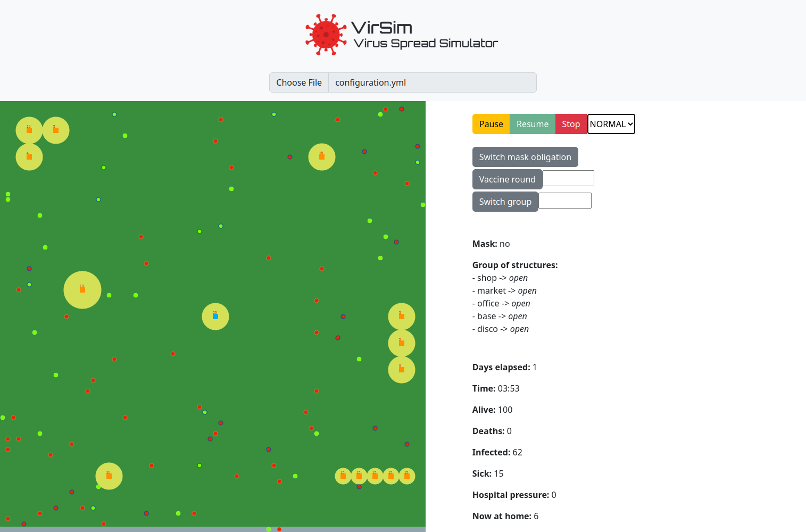

## Guida Utente

Il simulatore è utilizzabile sia attraverso l'applicativo Desktop, sia attraverso la WebApp.

### Applicazione Desktop

La schermata di avvio permette all'utente il caricamento del file di configurazione desiderato. L'applicazione Desktop lavora con configurazioni definite in Scala, in cui può essere sfruttato il DSL sviluppato. Al fine di selezionare il file, l'utente necessita solamente di cliccare sul pulsante "*Choose*" e selezionare il file dal *File Dialog* che apparirà. Dopodiché premendo il pulsante "*Start*" si potrà avviare la simulazione.

In caso ci siano errori all'interno della configurazione vengono visualizzati attraverso una finestra di dialogo apposita (nell'esempio all'interno della configurazione una struttura è stata posizionata al di fuori dell'environment):

Invece, nel caso in cui la configurazione sia valida verrà avviata la simulazione.

La schermata di simulazione offre due pannelli che consentono la visualizzazione delle informazioni relative alla simulazione stessa:

- il pannello a sinistra mostra lo stato corrente dell'environment mostrando le strutture presenti, il movimento delle entità e le interazioni con le strutture. In particolare:
  - le entità sono rappresentate attraverso un cerchio che assume diversi colori. Nel caso di individuo sano esso sarà di colore verde, di tonalità più accesa se giovane, e più scura con l'avanzare dell'età. Nel caso di inviduo infetto esso sarà di colore rosso. In entrambi i casi qualora l'entità abbia un valore di immunità residua maggiore di zero (a seguito di vaccinazione o guarigione) allora avrà un contorno di colore blu.
  - le strutture vengono rappresentate attraverso un quadrato il cui colore dipende dalla tipologia di struttura: arancione per le strutture generiche, azzurro per gli ospedali e grigio per le case. Per le strutture generiche e per gli ospedali viene mostrato il raggio di visibilità attraverso un cerchio di colore giallo con raggio più o meno ampio a seconda del valore. Nel caso in cui la struttura venga chiusa attraverso l'azione dinamica "*Switch group*" il raggio di visibilità non verrà disegnato. Sopra alla struttura stessa viene visualizzata la capacità residua.
- il panello a destra mostra invece i seguenti grafici:
  - *Deads, Sick and Healthy Entities*: attraverso un grafico a barre in pila vengono mostrati per ogni ora del giorno corrente il numero di individui morti, malati e in salute.
  - *Infected per Hour*: attravero un grafico a barre viene mostrato per ogni ora del giorno corrente il numero di individui infetti.
  - *Hospitals Pressure*: attraverso un grafico a torta viene mostrata la pressione ospedaliera (considerando tutti gli ospedali disponibili all'interno dell'environment).

L'utente ha la possibilità di interagire con la schermata attraverso il pannello inferiore in cui sono disponibili diverse sezioni:

- *Commands*: racchiude i comandi disponibili all'utente sulla simulazione. Potrà mettere in pausa, riprendere e stoppare la simulazione. Inoltre, è possibile attraverso la Combo Box cambiare la velocità di simulazione scegliendo tra SLOW, NORMAL e FAST.
- *Dynamic config values*: mostra all'utente lo stato corrente delle azioni dinamiche quali obbligo di mascherina e apertura dei gruppi di strutture.
- *Dynamic config*: racchiude le interazioni dinamiche che possono essere attivate dall'utente
  - *Switch mask obligation*: consente di invertire lo stato corrente di obbligo della mascherina.
  - *Vaccine round*: consente di eseguire una campagna di vaccinazione specificando una percentuale di adesione (esempio: 30) nel campo di testo a fianco.
  - *Switch group*: consente di invertire lo stato di apertura di un gruppo di strutture. Il gruppo è possibile specificarlo nel campo di testo a fianco.
- *Stats*: mostra all'utente le statistiche principali e i dati aggregati sulla simulazione.

Infine, nella directory dei file temporanei del proprio sistema operativo è possibile trovare nella directory `virsim-export` un file in formato `.csv` contenente i dati aggregati raccolti durante la simulazione.

#### Descrizione API file di configurazione Scala

Iniziare con **VirsimConfiguration()** e definire all'interno le keyword **simulation**, **virus** e **structures** separate da una virgola come nell'esempio seguente: `VirsimConfiguation(simulation, virus, structures)`.

In questo caso viene istanziata una configurazione di default senza strutture nell'environment.

Per i parametri della simulazione è possibile aggiungere in seguito alla keyword **simulation** i seguenti parametri:

  - *gridSide*: grandezza della griglia dell'environment. Deve essere compresa tra 20 e 100.
  - *days*: durata massima della simulazione in termini di giorni. 
  - *entities*: numero delle entità presenti nell'environment. Deve essere compreso tra 2 e 1000.
  - *averagePopulationAge*:  età media della popolazione.
  - *stdDevPopulationAge*: deviazione standard dell'età della popolazione.
  - *startingInfectedPercentage*: percentuale di infetti ad inizio simulazione.

Per i parametri del virus è possibile aggiungere alla keyword **virus** i seguenti parametri:

  - *name*: nome del virus presente nell'environment.
  - *spreadRate*: tasso di diffusione del virus.
  - *averagePositivityDays*: giorni medi di positività del virus.
  - *stdDevPositivityDays*: deviazione standard dei giorni di positività del virus.
  - *severeDeseaseProbability*: probabilità di sviluppare una forma grave della malattia. Deve essere compreso tra 0 e 1.
  - *maxInfectionDistance*: distanza massima entro la quale è possibile infettarsi.

Per quanto riguarda le strutture è possibile aggiungere alla keyword **structures** la keyword **are** ed in seguito l'elenco di strutture. Esse possono essere di due tipologie:

- *GenericBuilding*, con i parametri obbligatori: 

    - *position*: posizione della struttura all'interno della griglia.
    - *infectionProbability*: probabilità di infettarsi entrando nella struttura. Deve essere compreso tra 0 e 1.
    - *capacity*: numero massimo di persone che possono essere dentro alla struttura.

    ed i parametri opzionali:

    - *permanenceTimeDistribution*: tempo di permanenza dell'entità dentro la struttura.
    - *entranceStrategy*: strategia di ingresso della struttura.
    - *isOpen*: stato della struttura (aperta/chiusa).
    - *visibilityDistance*: grandezza del raggio di visibilità della struttura.
    - *group*: tipologia della struttura.

- Hospital, con i parametri obbligatori: 

    - *position*: posizione della struttura all'interno della griglia.
    - *infectionProbability*: probabilità di infettarsi entrando nella struttura. Deve essere compreso tra 0 e 1.
    - *capacity*: numero massimo di persone che possono essere dentro alla struttura.

    ed i parametri opzionali:

    - *entranceStrategy*: strategia di ingresso della struttura.
    - *isOpen*: stato della struttura (aperta/chiusa).
    - *visibilityDistance*: grandezza del raggio di visibilità della struttura.
    - *treatmentQuality*: efficacia dell'ospedale nella cura delle entità.

Un esempio di configurazione si trova nei file associati alla release. [Link](https://github.com/VirusSpreadSimulator/PPS-22-virsim/releases/latest/download/configuration.scala)

### WebApp

La WebApp presenta un'unica schermata in cui dopo aver selezionato il file di configurazione YAML attraverso il pulsante "*Choose File*" viene visualizzata la seguente schermata:

La WebApp prevede tutte le funzionalità come descritte nella versione Desktop ad eccezione della visualizzazione dei grafici e dell'esportatore di dati aggregati.

#### Descrizione file di configurazione YAML

Nella configurazione in formato YAML è possibile definire i parametri della simulazione, del virus e delle strutture all'interno delle keywords **simulation**, **structures**, **virus**.

Nello specifico, la keyword structures accetta una lista di strutture di tipologia **GenericBuilding** oppure **Hospital**.

A differenza della configurazione in formato Scala, per motivi legati alla difficoltà nell'istanziare delle classi in un formato chiave-valore, non è possibile definire i parametri **permanenceTimeDistribution**, **treatmentQuality**, **isOpen**.

Mentre per quanto riguarda la strategia di ingresso è possibile definire le seguenti strategie:

- *probability*: valore da 0 a 1 che rappresenta la probabilità di entrare nella struttura.

- *ageLowerThan*: valore che rappresenta l'età massima per entrare nella struttura.
- *ageGreaterThan*: valore che rappresenta l'età minima per entrare nella struttura.

Nel caso in cui non si volessero modificare i parametri di default è possibile creare un file di configurazione vuoto specificando solamente:

 `simulation: {}`

Un esempio di configurazione si trova nei file associati alla release. [Link](https://github.com/VirusSpreadSimulator/PPS-22-virsim/releases/latest/download/configuration.yml)
